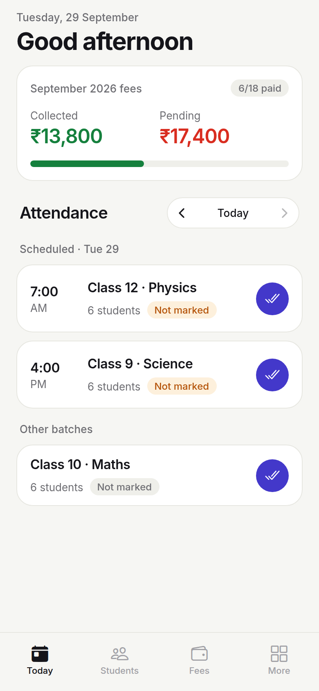
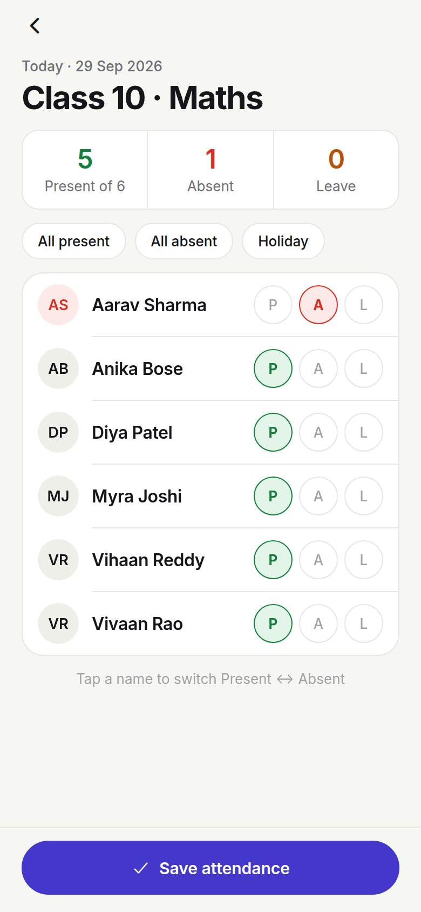
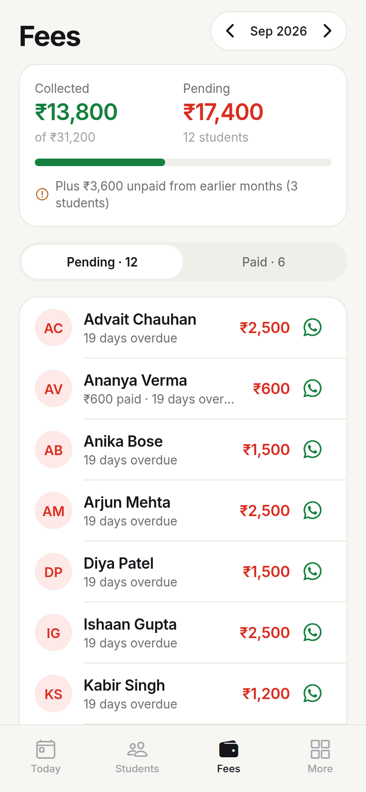
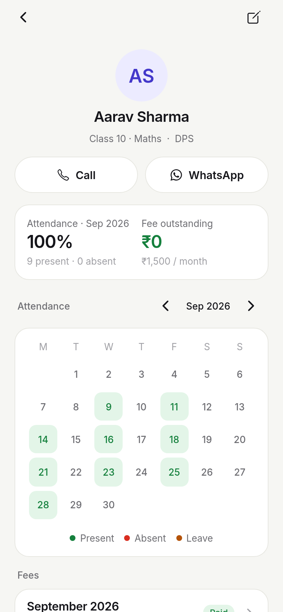
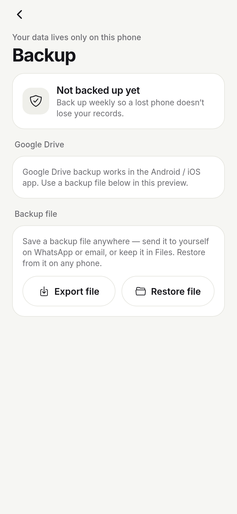

# TuitionBook

A minimal tuition management app for home tutors and small coaching centres: **attendance**, **student list**, and **fees (who paid, who's pending)**. It works fully offline. All data stays in a SQLite database on the phone, and you can back it up manually to **Google Drive** or to a file.

Built with Expo SDK 57 (React Native 0.86), TypeScript, Expo Router and expo-sqlite.

| Today | Attendance | Fees | Student | Backup |
|---|---|---|---|---|
|  |  |  |  |  |

---

## Features

No setup: open the app, add your students, and start.

**Today**
- One attendance card for the day: how many students, whether it's taken, and present/absent/leave counts. It also shows a holiday and its name.
- Step back to earlier days to fill in attendance you missed.
- This month's fees at a glance: collected vs pending.

**Attendance**
- One roll for all students. Everyone starts as Present; tap a name to switch it to Absent. **P / A / L** buttons set Present, Absent or Leave.
- One-tap **All present**, **All absent** and **Holiday**. Holidays and leave don't count towards attendance %.
- After saving, the app offers to **WhatsApp the parents of absent students**.

**Calendar**
- A month grid: each day shows present/total once attendance is taken, holidays with a ☀, and planned leave with a dot. You can go into future months to plan.
- **Tap any date** to see every student's status that day. From there you can:
  - **mark a holiday**, with an optional name like "Diwali", on any date, including future ones
  - **add leave with a reason** (e.g. "Sick", "Family function") for any student, including leave planned ahead
  - change a single mark, or open the full roll.
- The month summary shows days taken, holidays and average attendance, plus each student's % for the month.

**Students**
- Search by name, phone or class; filter by **Fee pending**; see archived students.
- **Save & add another** keeps the class, fee and joining date, so entering a whole class is quick.
- A default monthly fee (Settings) pre-fills for new students.
- Student page: Call and WhatsApp buttons, attendance calendar and %, outstanding fees, fee history, notes.
- Archiving a student keeps their history and stops new monthly fees.

**Fees**
- On the 1st of every month the app adds a due for each active student, starting from their joining month.
- **Pending / Paid** tabs for any month, with totals and arrears from earlier months.
- Record a payment (Cash / UPI / Bank / Other). Partial payments are allowed; overpayments and future dates are blocked.
- Statuses are **Paid**, **Partial**, **Pending** and **Overdue** (overdue after the due day you set).
- WhatsApp **fee reminders** and **payment receipts**, pre-filled. You can also share the whole pending list.
- Change one month's amount for a discount. Changing the student's fee applies from this month on.

**Backup (manual)**
- **Google Drive**: connect a Google account, then tap **Back up to Drive now**. Backups go into a *TuitionBook Backups* folder in your own Drive. From there you can restore or delete any backup, on this phone or a new one.
- **Backup file**: export a `.json` file and send it anywhere (WhatsApp to yourself, email, Files). Restore from it on any phone.
- A restore replaces what's on the phone in a single transaction. If it fails, nothing changes.
- Older backups, including those from version 1.0 which had batches, still restore.

Also included: light and dark mode, sample data to try the app (**More → Settings**), and erase all data.

## Run it

```bash
npm install
npx expo start --web      # quick UI preview in the browser (Drive backup is phone-only)
```

The app uses native modules for Google Sign-In, so it **does not run in Expo Go**. To run it on a phone, build it as described below.

## Build an Android APK

### Option A — GitHub Actions (set up in this repo)

Every push to `main` runs `.github/workflows/android.yml`:

1. **Build.** Runs the tests, generates the Android project, and builds **unsigned** release APKs (minified, one per CPU type plus a universal one). They are published to the `apk-builds` branch as `tuitionbook-<abi>-unsigned.apk`:
   - `arm64-v8a`: almost all phones from 2017 onwards
   - `armeabi-v7a`: older or low-end 32-bit phones
   - `x86_64`: Chromebooks and emulators
   - `universal`: works everywhere, but is the largest
2. **Emulator test.** Installs the app on an Android 14 emulator in airplane mode and runs the Maestro flows in `tests/android/`: sample data, attendance, a payment, search, the backup screen, a restart to check the data is still there, and dark mode. Screenshots, logs and any crash traces are published to the `e2e-results` branch.

You can re-run everything from **Actions → Android APK → Run workflow**.

**Sign it** with your release key. The key is never stored on GitHub, and you must keep it safe: Android will only install updates signed with the same key.

```bash
# uber-apk-signer: https://github.com/patrickfav/uber-apk-signer/releases
java -jar uber-apk-signer-1.3.0.jar --apks tuitionbook-arm64-v8a-unsigned.apk \
  --ks tuitionbook-release.jks --ksAlias tuitionbook --ksPass <password> --ksKeyPass <password>
```

### Option B — EAS cloud build

```bash
npx eas-cli@latest login          # free Expo account
npm run build:apk                 # = eas build -p android --profile preview
```

### Option C — on your computer

You need Android Studio (with the Android SDK) and JDK 17. Run `npx expo run:android --variant release`.

---

## Google Drive setup (one time, about 10 minutes)

Drive backup needs an OAuth client, which is free. Until you do this, file backup still works; only the Drive button shows a setup error.

1. Go to **[Google Cloud Console](https://console.cloud.google.com/)** and create a project, e.g. "TuitionBook".
2. Open **APIs & Services → Library**, find **Google Drive API** and click **Enable**.
3. Open **APIs & Services → OAuth consent screen**:
   - User type: **External**. Enter the app name and your email.
   - Scopes: add `.../auth/drive.file`. This is a *non-sensitive* scope, so the app can only see the backup files it created.
   - While the app is in *Testing*, add your Google account under **Test users**. Publish the app when you want anyone to be able to use it.
4. Open **Credentials → Create credentials → OAuth client ID → Web application** and copy its **Client ID**.
   Paste it into `app.json` under `expo.extra.googleWebClientId`.
5. Open **Credentials → Create credentials → OAuth client ID → Android**:
   - Package name: `com.tuitionbook.app` (change it in `app.json` first if you want your own).
   - **SHA-1 certificate fingerprint** of the key that signs your APK:
     - APKs signed with the `tuitionbook-release.jks` key (Option A): use that key's SHA-1, which is in `SIGNING-KEY-README.txt` next to the key.
     - EAS builds: run `npx eas-cli@latest credentials -p android` and copy the SHA-1.
     - Local debug builds: run `cd android && ./gradlew signingReport`.
     - Play Store: also add the **App signing key** SHA-1 from Play Console → *Setup → App integrity*.
6. Rebuild the app. Then go to **More → Backup & restore → Connect Google account**.

*iOS (optional):* create an **iOS** OAuth client and put its reversed client ID (`com.googleusercontent.apps.XXXX`) in the `iosUrlScheme` option of the `@react-native-google-signin/google-signin` plugin in `app.json`.

If sign-in shows *"not set up for this build (OAuth client / SHA-1)"*, the SHA-1 or the package name in step 5 doesn't match the build installed on the phone.

---

## How the data works

- **Storage:** `tuitionbook.db` (SQLite, WAL mode) in the app's private storage. No server, no account and no internet are needed for daily use.
- **Schema** (`src/db/schema.ts`): `students`, `attendance` (one mark per student per day, with an optional note such as a leave reason), `holidays` (date + name), `fee_dues` (one per student per month), `payments` (many per due), `settings`. Versioned migrations use `PRAGMA user_version`. v3 removed batches: marks from several batches on one day are merged, and days that were all "holiday" become holidays.
- **Money** is stored in whole rupees as integers. **Dates** are stored as local `YYYY-MM-DD` strings, so time zones never shift them.
- **Monthly dues** (`ensureDues`) are created on every launch for any month that is missing. Running it more than once is safe.
- **Backup format** (`src/backup/snapshot.ts`): one JSON file with `app`, `schemaVersion`, `exportedAt`, row counts and every table. A backup made by a newer app version is refused, so an old app can't misread it.
- **Drive** (`src/backup/drive.ts`): uploads to Drive REST v3 as a multipart upload. If the token has expired (401), it refreshes the token once and retries.

## Project layout

```
src/
  app/                    screens (Expo Router)
    (tabs)/               Today · Calendar · Students · Fees · More
    attendance.tsx        roll call for a date
    day/[date]            day details: each student, holiday, leave
    student/[id], form    student detail, add/edit
    payment/[dueId]       record payment, receipts, discount
    backup.tsx            Google Drive + file backup/restore
    settings.tsx
  db/                     schema + migrations, queries (repo.ts), live-query hook, sample data
  backup/                 snapshot format, Drive REST, Google sign-in (+ web stub), file export/import
  ui/                     theme (light/dark tokens) and components
  lib/                    date and formatting helpers
```

## Tests

```bash
npm run typecheck
npm run lint
npm test          # 50 data-layer tests on real SQLite with a fake clock
```

`npm test` covers month and year boundaries, leap years, archive and restore, joining-date and fee edits, partial payments, overpayments, overdue rules, attendance rules, search, cascade deletes, and backup/restore including failure rollback.

End-to-end UI flows (39 of them) run against the web preview:

```bash
npx expo start --web --port 8081
npm i -D playwright && npx playwright install chromium
node tests/e2e/flows.mjs http://localhost:8081
```
